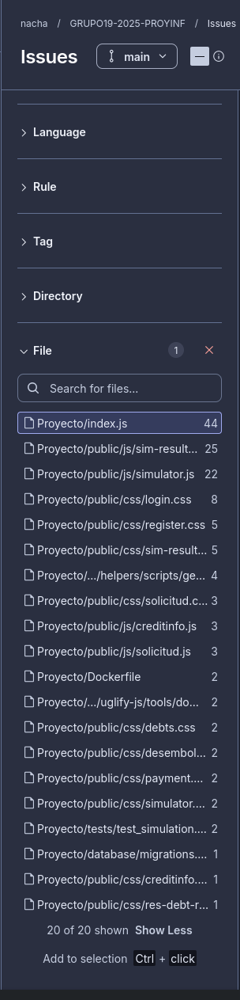
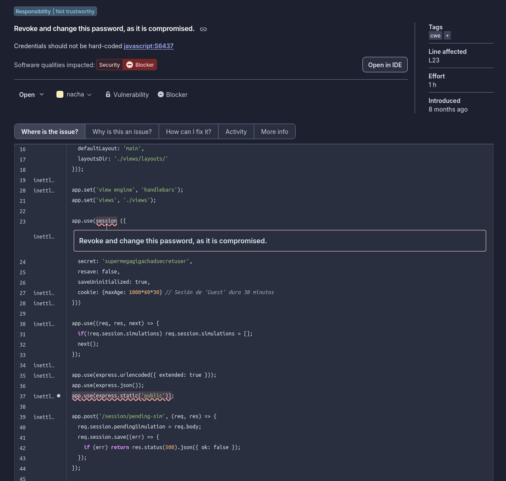
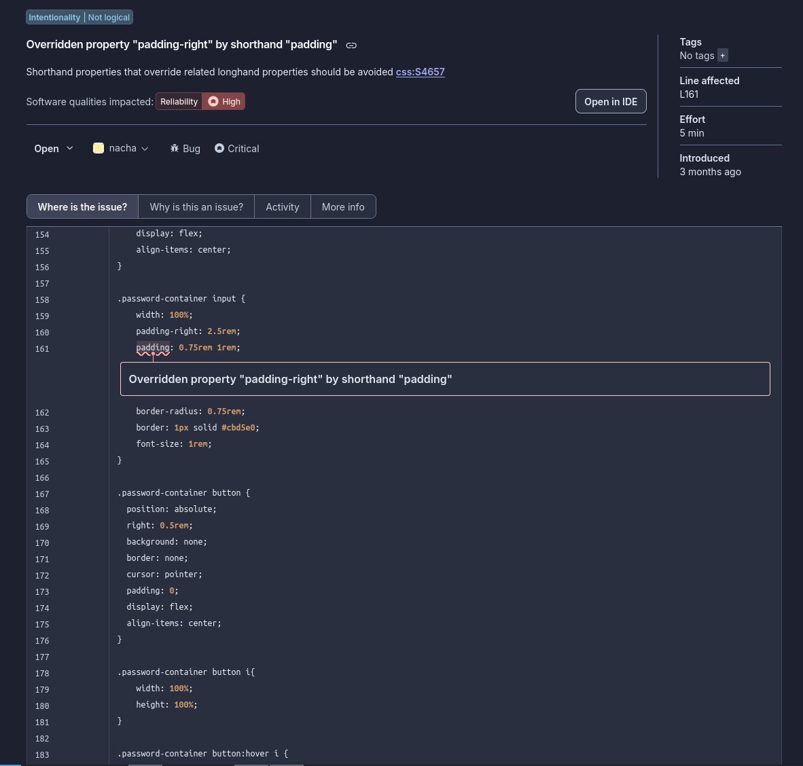

# Reporte de Inspección de Código - SonarCloud

Este documento detalla los hallazgos de la inspección automática de código realizada con SonarCloud para el proyecto.

## Resumen del Estado del Proyecto
A continuación se presenta el estado general obtenido en el dashboard de SonarCloud:

---

## 1. Primer Quality Issue: Credenciales Hardcodeadas (JavaScript)

* **Archivo / Línea afectada:** Proyecto/index.js / Línea 23
* **Impacto en Calidad:** Security (Seguridad)
* **Severidad / Tipo:** Bloqueante / Vulnerabilidad
* **Regla SonarCloud:** `javascript:S6437` - *Credentials should not be hard-coded.*

### Descripción del problema
Se detectó una vulnerabilidad crítica debido a que la clave secreta de la sesión (`secret: 'supermegagigachadsecretuser'`) se encuentra expuesta directamente en texto plano dentro del código fuente de la aplicación. 

### Recomendación de la aplicación y resolución
* **Recomendación:** Revocar y cambiar esta contraseña inmediatamente, ya que al estar expuesta en el código (y más en un repositorio público) se considera comprometida.
* **Cómo se abordará:** **Se considera prioritario.** El secreto no se dejará en el código. Se implementará el uso de variables de entorno mediante un archivo `.env` (usando la librería `dotenv`) y se agregará dicho archivo al `.gitignore` para evitar que las credenciales reales se suban al repositorio.

---

## 2. Segundo Quality Issue: Propiedad CSS Sobreescrita (CSS)

* **Archivo / Línea afectada:** Proyecto/public/css/login.css / Línea 161
* **Impacto en Calidad:** Reliability (Confiabilidad)
* **Severidad / Tipo:** Alta / Crítico
* **Regla SonarCloud:** `css:S4657` - *Shorthand properties that override related longhand properties should be avoided.*

### Descripción del problema
En el archivo de estilos, dentro de la clase `.password-container input`, se definió primero de forma específica `padding-right: 2.5rem;`, pero inmediatamente en la línea siguiente se utilizó la propiedad atajo `padding: 0.75rem 1rem;`. Esto último sobreescribe por completo el margen derecho que se había calculado previamente, haciendo que la primera línea sea código muerto e inútil.

### Recomendación de la aplicación y resolución
* **Recomendación:** Evitar el uso de propiedades *shorthand* (como `padding`) justo después de especificar un lado de forma individual (*longhand*), o bien reordenar las reglas correctamente.
* **Cómo se abordará:** **Se considera para la mejora.** Se corregirá el CSS reordenando o unificando la propiedad para que el `padding-right` específico de `2.5rem` se aplique correctamente (por ejemplo, declarando el shorthand primero y luego el valor específico, o combinando todo en una sola línea de padding: `padding: 0.75rem 2.5rem 0.75rem 1rem;`).